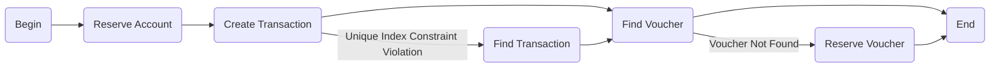
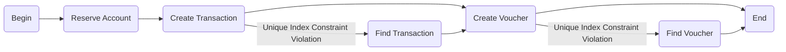

# Pulse

Pulse is a High Perfomance Voucher API built using Node.js (Fastify).

## Static Vouchers

```mermaid
flowchart LR
    A(Begin) --> B(Reserve Account) --> C(Create Transaction) --> D(Find Voucher) --> E(End)
    C -->|Unique Index Constraint Violation| F(Find Transaction) --> D
    D -->|Voucher Not Found| G(Reserve Voucher) --> E
```

## Dynamic Vouchers

```mermaid
flowchart LR
    A(Begin) --> B(Reserve Account) --> C(Create Transaction) --> D(Create Voucher) --> E(End)
    C -->|Unique Index Constraint Violation| F(Find Transaction) --> D
    D -->|Unique Index Constraint Violation| G(Find Voucher) --> E
```
